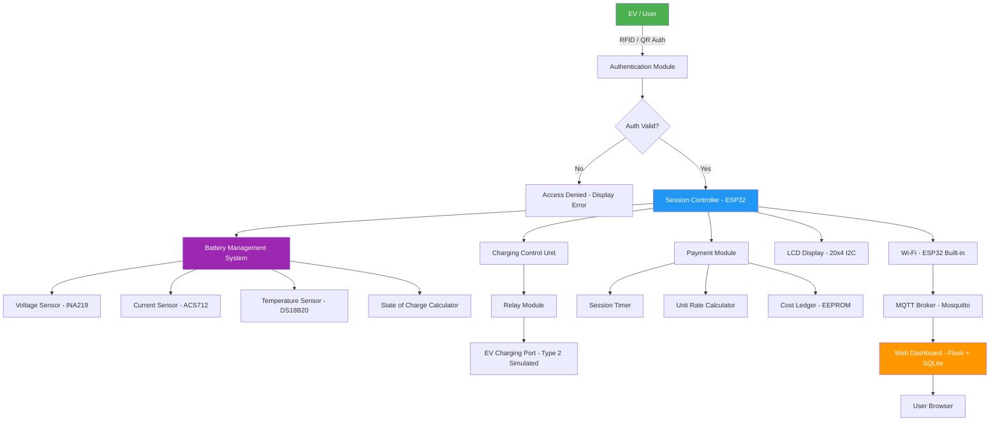
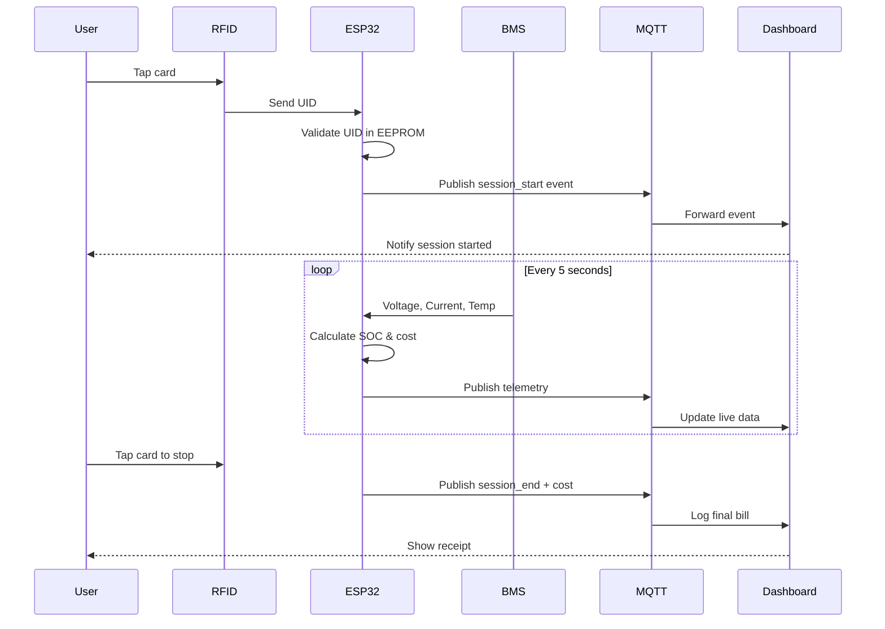
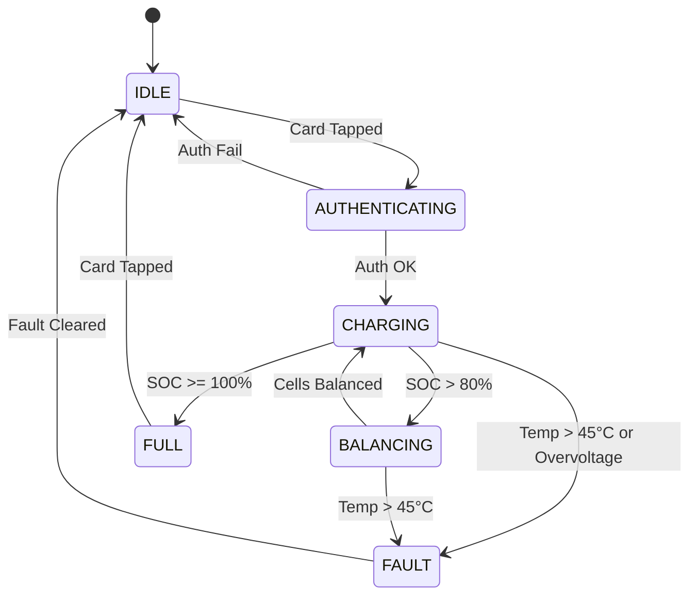

# Smart EV Charging System with Battery Management

> Diploma Final Year Project — Automated EV Charging Station with Payment Integration, Battery Health Monitoring, and Real-Time Dashboard

[](LICENSE)
[](https://www.espressif.com/)
[](https://www.python.org/)
[]()
[](CONTRIBUTING.md)

---

## Table of Contents

- [Project Overview](#project-overview)
- [System Architecture](#system-architecture)
- [Features](#features)
- [Hardware Requirements](#hardware-requirements)
- [Software Requirements](#software-requirements)
- [Working Principle](#working-principle)
- [Folder Structure](#folder-structure)
- [Setup & Installation](#setup--installation)
- [Dashboard Screenshots](#dashboard-screenshots)
- [Demo](#demo)
- [Technical Documentation](#technical-documentation)
- [Future Improvements](#future-improvements)
- [Contributing](#contributing)
- [License](#license)
- [Team](#team)

---

## Project Overview

The **Smart EV Charging System** is an embedded systems project designed to automate the process of electric vehicle charging at a station level. Built on the **ESP32 microcontroller**, the system integrates real-time **battery health monitoring** (BMS), **RFID-based user authentication**, **automated payment tracking**, and a **web-based dashboard** for live session data.

This project targets small-scale EV charging infrastructure — such as college campuses, apartment parking, or small commercial setups — where deploying a low-cost, intelligent charging station is practical.

> **Academic Scope:** This is a diploma-level prototype. Real-world deployment would require certified hardware, grid compliance, and safety approvals beyond this project's scope.

---

## System Architecture



### Communication Flow



### Battery State Machine



---

## Features

| Feature | Description | Status |
|---|---|---|
| RFID Authentication | MFRC522 card reader for user login | Implemented |
| Battery SOC Estimation | Coulomb counting + voltage curve | Implemented |
| Temperature Protection | Auto cut-off at >45°C | Implemented |
| Overvoltage Protection | Relay trip at >4.25V/cell | Implemented |
| Session Timer | Tracks charge duration in HH:MM:SS | Implemented |
| Cost Calculation | Per-unit rate × energy drawn (kWh) | Implemented |
| EEPROM Logging | Stores last 20 sessions locally | Implemented |
| LCD Status Display | 20×4 I2C display for live data | Implemented |
| Wi-Fi MQTT Uplink | Publishes telemetry every 5 seconds | Implemented |
| Web Dashboard | Flask app with Chart.js graphs | Implemented |
| SQLite History | Persistent session and payment history | Implemented |
| Mobile-Responsive UI | Dashboard works on phone browsers | Implemented |
| Cell Balancing Indicator | Alerts when passive balancing active | Implemented |
| Buzzer Alerts | Audio cue on fault / session end | Implemented |

---

## Hardware Requirements

| Component | Specification | Quantity | Purpose |
|---|---|---|---|
| ESP32 DevKit v1 | 240 MHz, Wi-Fi + BT, 4 MB Flash | 1 | Main controller |
| MFRC522 RFID Module | 13.56 MHz, SPI interface | 1 | User authentication |
| INA219 Current/Voltage Sensor | 26V / 3.2A, I2C, 12-bit ADC | 1 | Power measurement |
| ACS712-5A | Hall-effect current sensor, ±5A | 1 | High-side current sense |
| DS18B20 Temperature Sensor | -55°C to +125°C, 1-Wire, ±0.5°C | 2 | Cell + ambient temp |
| 5V Relay Module | 10A / 250VAC rated | 1 | Charging circuit control |
| LCD 20×4 I2C | HD44780 + PCF8574 backpack | 1 | Status display |
| Active Buzzer | 5V, 85dB | 1 | Audio alerts |
| 18650 Li-ion Cell Pack | 3S2P configuration, ~7.4V nominal | 1 | Simulated EV battery |
| TP4056 Charging Module | 4.2V, 1A, with protection | 1 | Bench-level charging demo |
| Breadboard + Jumper Wires | Standard 830-point breadboard | 1 set | Prototyping |
| 5V 3A USB Power Adapter | For ESP32 and module power | 1 | System power supply |
| 4.7kΩ Resistor | Pull-up for DS18B20 1-Wire | 2 | Signal integrity |

### Pin Mapping (ESP32 DevKit v1)

| ESP32 Pin | Connected To | Protocol |
|---|---|---|
| GPIO 5 (SS) | MFRC522 SDA | SPI |
| GPIO 18 (SCK) | MFRC522 SCK | SPI |
| GPIO 23 (MOSI) | MFRC522 MOSI | SPI |
| GPIO 19 (MISO) | MFRC522 MISO | SPI |
| GPIO 22 (SCL) | INA219 + LCD SCL | I2C |
| GPIO 21 (SDA) | INA219 + LCD SDA | I2C |
| GPIO 4 | DS18B20 Data | 1-Wire |
| GPIO 26 | Relay IN | Digital OUT |
| GPIO 27 | Buzzer | Digital OUT |
| 3.3V / GND | All module VCC/GND | Power |

---

## Software Requirements

### Firmware (ESP32 / Arduino IDE)

| Library | Version | Purpose |
|---|---|---|
| Arduino ESP32 Core | 2.0.14 | Base board support |
| MFRC522 | 1.4.10 | RFID reader driver |
| Adafruit INA219 | 1.2.3 | Power sensor driver |
| OneWire | 2.3.7 | DS18B20 bus |
| DallasTemperature | 3.9.0 | DS18B20 temperature read |
| LiquidCrystal_I2C | 1.1.3 | LCD display |
| PubSubClient | 2.8.0 | MQTT client |
| ArduinoJson | 6.21.3 | JSON payload serialization |
| EEPROM (built-in) | — | Session log storage |
| WiFi (built-in) | — | Network connectivity |

### Backend & Dashboard (Python)

| Package | Version | Purpose |
|---|---|---|
| Flask | 3.0.3 | Web server / dashboard |
| flask-mqtt | 1.1.1 | MQTT subscriber |
| Flask-SQLAlchemy | 3.1.1 | ORM for session database |
| paho-mqtt | 1.6.1 | MQTT client |
| Chart.js | 4.4.2 (CDN) | Frontend graphs |
| Bootstrap | 5.3.2 (CDN) | Dashboard styling |
| python-dotenv | 1.0.1 | Config management |
| pytest | 8.2.0 | Unit testing |

### Tools

- Arduino IDE 2.3.x or PlatformIO
- Mosquitto MQTT Broker (local)
- Python 3.9+
- SQLite (bundled with Python)
- Git

---

## Working Principle

See [docs/working-principle.md](docs/working-principle.md) for a detailed explanation. Summary:

1. **Authentication** — User taps RFID card. ESP32 reads UID via SPI and validates against stored UIDs in EEPROM. Invalid card triggers buzzer and LCD error message.

2. **Session Start** — On valid auth, the relay closes, connecting the charging circuit. A session timestamp is recorded in EEPROM and published to the MQTT broker.

3. **Battery Monitoring** — Every 5 seconds, the INA219 measures voltage and current. DS18B20 measures cell and ambient temperature. State of Charge (SOC) is estimated using a combination of coulomb counting and a voltage-SOC lookup table for Li-ion chemistry.

4. **Safety Cut-off** — If temperature exceeds 45°C, voltage exceeds 4.25V/cell, or current exceeds 5A (ACS712 limit), the relay opens immediately, the buzzer fires, and a FAULT state is entered. Manual card tap required to reset.

5. **Cost Tracking** — Energy drawn is integrated (Power × Time = Energy in Wh). At session end, cost = (Energy in kWh) × unit rate (₹ configurable). Stored in EEPROM and uploaded via MQTT.

6. **Session End** — User taps card again. Relay opens, final bill is displayed on LCD for 10 seconds and published to dashboard.

7. **Dashboard** — Flask web app subscribes to MQTT topics and logs data to SQLite. The browser dashboard polls a REST endpoint every 5 seconds to display live charts, session history, and payment records.

---

## Folder Structure

```
SmartEV-Charging-System/
│
├── README.md                        # This file
├── LICENSE                          # MIT License
├── CONTRIBUTING.md                  # Contribution guidelines
├── .gitignore
│
├── docs/                            # All documentation
│   ├── architecture.md              # Deep-dive system architecture
│   ├── working-principle.md         # How the system works
│   ├── hardware-requirements.md     # BOM and pin maps
│   ├── software-requirements.md     # Libraries and tools
│   ├── technical-documentation.md   # Code-level docs
│   └── future-improvements.md       # Roadmap
│
├── firmware/                        # ESP32 Arduino code
│   ├── src/
│   │   ├── main.ino                 # Main entry point
│   │   ├── config.h                 # Pin defs, constants, credentials
│   │   ├── bms.h / bms.cpp          # Battery management logic
│   │   ├── auth.h / auth.cpp        # RFID authentication
│   │   ├── payment.h / payment.cpp  # Cost calculation
│   │   └── mqtt_handler.h / .cpp    # MQTT publish/subscribe
│   └── lib/                         # Local library overrides (if any)
│
├── software/                        # Host-side Python code
│   ├── dashboard/
│   │   ├── app.py                   # Flask app (routes + MQTT listener)
│   │   ├── models.py                # SQLAlchemy models
│   │   ├── templates/
│   │   │   └── index.html           # Dashboard HTML (Chart.js + Bootstrap)
│   │   └── static/
│   │       ├── style.css
│   │       └── dashboard.js
│   ├── payment/
│   │   └── payment_handler.py       # Payment logic (standalone utility)
│   └── requirements.txt
│
├── hardware/
│   ├── schematics/
│   │   ├── schematic.pdf            # Full circuit schematic
│   │   └── README.md
│   └── pcb/
│       └── README.md                # PCB notes (future scope)
│
├── simulation/
│   └── README.md                    # Wokwi / Proteus simulation notes
│
├── tests/
│   ├── test_bms.py                  # Unit tests for SOC calculation
│   ├── test_payment.py              # Unit tests for billing logic
│   └── test_dashboard_api.py        # Flask API tests
│
└── assets/
    ├── screenshots/
    │   ├── dashboard_home.png        # [See below]
    │   ├── session_active.png
    │   ├── payment_history.png
    │   └── lcd_display.jpg
    └── diagrams/
        ├── block_diagram.png
        └── circuit_schematic.png
```

---

## Setup & Installation

### 1. Flash the Firmware

```bash
# Clone the repository
git clone https://github.com/yourusername/SmartEV-Charging-System.git
cd SmartEV-Charging-System
```

Open `firmware/src/config.h` and set your credentials:

```cpp
// firmware/src/config.h
#define WIFI_SSID       "YourWiFiSSID"
#define WIFI_PASSWORD   "YourWiFiPassword"
#define MQTT_BROKER     "192.168.1.100"   // IP of your Mosquitto broker
#define MQTT_PORT       1883
#define UNIT_RATE_RS    8.0               // ₹ per kWh
#define TEMP_CUTOFF_C   45.0              // Celsius
#define VOLT_CUTOFF     4.25              // Volts per cell
```

Flash using Arduino IDE 2.x:
- Board: `ESP32 Dev Module`
- Upload Speed: `115200`
- Partition Scheme: `Default 4MB with spiffs`

### 2. Start MQTT Broker

```bash
# Install Mosquitto (Ubuntu/Debian)
sudo apt install mosquitto mosquitto-clients

# Start broker
sudo systemctl start mosquitto

# Test subscription
mosquitto_sub -t "ev/telemetry/#" -v
```

### 3. Run the Dashboard

```bash
cd software/dashboard

# Create virtual environment
python -m venv venv
source venv/bin/activate        # Linux/Mac
venv\Scripts\activate           # Windows

# Install dependencies
pip install -r ../requirements.txt

# Run Flask app
python app.py
```

Open `http://localhost:5000` in your browser.

### 4. Run Tests

```bash
cd tests
pytest -v
```

---

## Dashboard Screenshots

> Screenshots from the working prototype. Replace these placeholders with actual images.

### Home Dashboard

*Live session status, SOC gauge, temperature, and current draw.*

### Active Charging Session

*Real-time power consumption graph during a charging session.*

### Payment History

*Session log with timestamps, energy consumed, and amount billed.*

### Hardware Setup

*LCD showing SOC, voltage, and session cost during active charging.*

---

## Demo

> Replace with your actual screen-recorded GIF.


*GIF showing: card tap → session start → live telemetry on dashboard → card tap → bill displayed.*

---

## Technical Documentation

Full technical documentation is in the [`docs/`](docs/) folder:

- [System Architecture](docs/architecture.md)
- [Working Principle](docs/working-principle.md)
- [Hardware Requirements & BOM](docs/hardware-requirements.md)
- [Software Requirements](docs/software-requirements.md)
- [Technical Documentation](docs/technical-documentation.md)
- [Future Improvements](docs/future-improvements.md)

---

## Future Improvements

| Priority | Feature | Notes |
|---|---|---|
| High | OCPP 1.6 Protocol | Interoperability with standard charge point management systems |
| High | GSM/4G Fallback | Connectivity where Wi-Fi is unavailable |
| Medium | Mobile App (Flutter) | Replace browser dashboard with native app |
| Medium | QR Code Payment | UPI / Razorpay integration for cashless payment |
| Medium | Multi-Port Support | Expand to 4-port station with shared BMS |
| Low | Solar Input Integration | MPPT charge controller for solar-assisted charging |
| Low | Cloud Deployment | AWS IoT Core / Firebase instead of local MQTT |

See [docs/future-improvements.md](docs/future-improvements.md) for detailed analysis.

---

## Contributing

Contributions, issues, and feature requests are welcome. See [CONTRIBUTING.md](CONTRIBUTING.md) for guidelines.

---

## License

This project is licensed under the [MIT License](LICENSE).

---

## Team

| Name | Role | Contact |
|---|---|---|
| [Your Name] | Project Lead, Firmware | youremail@example.com |
| [Teammate 1] | Hardware & BMS | teammate1@example.com |
| [Teammate 2] | Dashboard & Backend | teammate2@example.com |

**Guide:** [Mentor Name], Department of Electronics & Communication Engineering

**Institution:** [Your College Name], [City]

---

> *Built as a Diploma Final Year Project. Not certified for commercial or grid-connected deployment.*
