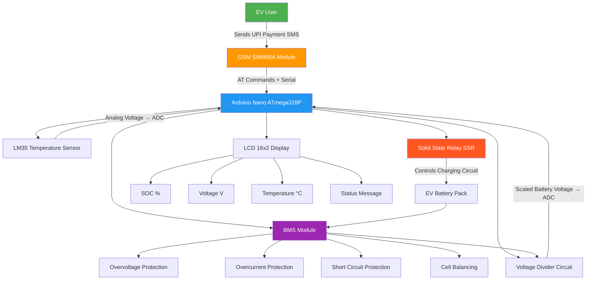
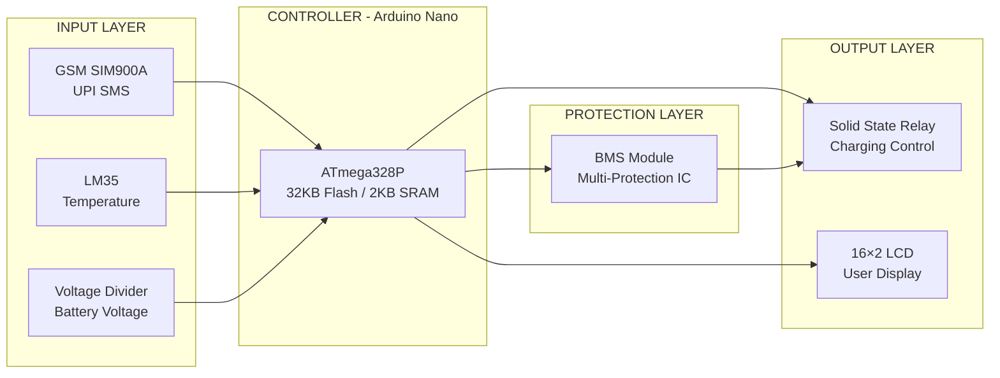
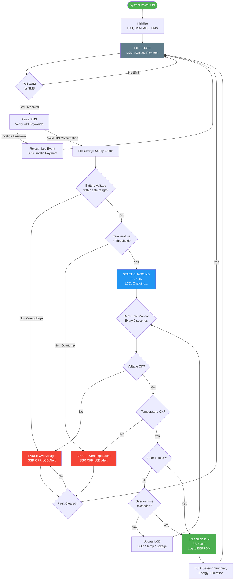
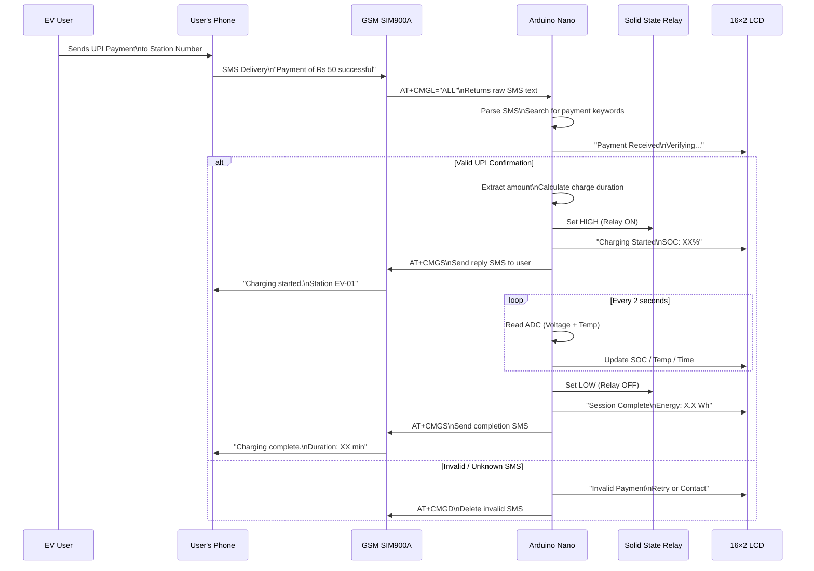
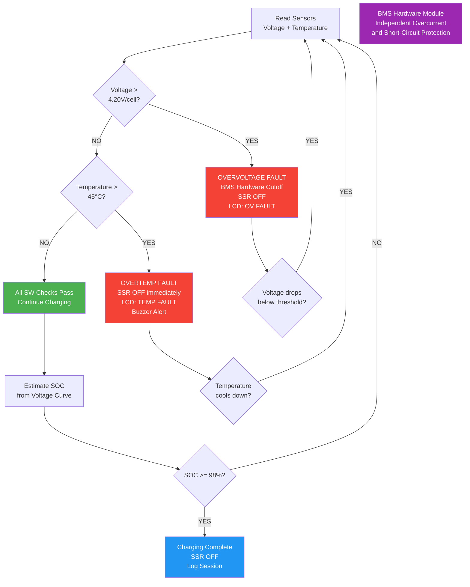
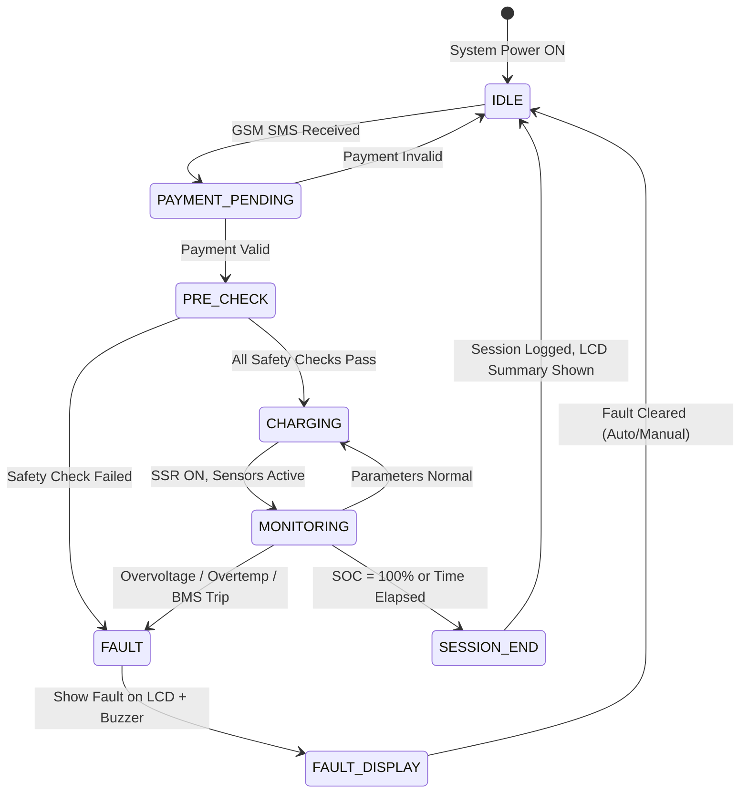

# Smart EV Charging Station with Battery Management System (BMS)

<div align="center">


**Arduino Nano • GSM SIM900A • Battery Safety Monitoring • Smart Charging Control**

*Selected and presented at State-Level Technical Exhibition*

</div>

---

## Table of Contents

- [Project Overview](#project-overview)
- [Problem Statement](#problem-statement)
- [System Architecture](#system-architecture)
- [Features](#features)
- [Working Flow](#working-flow)
- [Hardware Components](#hardware-components)
- [Technical Specifications](#technical-specifications)
- [GSM Communication Flow](#gsm-communication-flow)
- [Battery Safety Logic](#battery-safety-logic)
- [Charging State Machine](#charging-state-machine)
- [Key Engineering Contributions](#key-engineering-contributions)
- [Results](#results)
- [Applications](#applications)
- [Future Engineering Enhancements](#future-engineering-enhancements)
- [Folder Structure](#folder-structure)
- [Documentation](#documentation)
- [License](#license)

---

## Project Overview

The **Smart EV Charging Station with BMS** is an embedded systems project that automates electric vehicle charging at the station level using an **Arduino Nano microcontroller**. The system integrates **GSM SIM900A** for SMS-based UPI payment verification, a **commercial BMS module** for multi-layer battery protection, a **Solid State Relay (SSR)** for silent charging control, and an **LM35 temperature sensor** for thermal safety monitoring.

The project was **physically built and demonstrated** — not a simulation. It was **selected for a State-Level Technical Exhibition**, validating the engineering approach and practical implementation.

> **Academic Scope:** This is a diploma-level prototype. Commercial deployment would require grid certification, safety approvals, and industrial-grade hardware beyond this project's scope.

---

## Problem Statement

India's EV adoption is accelerating — **30% CAGR** in EV sales — but charging infrastructure is critically underdeveloped:

- **Unmanaged charging** degrades battery packs prematurely, costing EV owners ₹30,000–₹80,000 in early replacements
- **No payment intelligence** at small stations forces cash-only or manual billing, creating fraud and reconciliation problems
- **Thermal runaway incidents** in Li-ion batteries are rising due to overcharging without temperature monitoring
- **Over-voltage conditions** on 3S–4S packs go undetected in low-cost chargers, permanently damaging cells
- **Existing solutions** (commercial EVSE) cost ₹1.5L–₹5L per point — unaffordable for college campuses, apartment parking, or rural setups

This project addresses all five problems in a **sub-₹3,000 hardware budget**, demonstrating that smart EV charging is achievable at a low cost.

---

## System Architecture



### Block Diagram



---

## Features

| Feature | Description | Status |
|---|---|---|
| GSM-Enabled Charging | SIM900A receives and parses UPI payment SMS to authorize charging | ✅ Implemented |
| UPI Payment Verification | Parses incoming SMS for payment confirmation before releasing charge | ✅ Implemented |
| Smart Charging Duration | Calculates charging time based on detected battery level and unit rate | ✅ Implemented |
| Battery Voltage Monitoring | Voltage divider + Arduino ADC reads pack voltage every 2 seconds | ✅ Implemented |
| Temperature Protection | LM35 monitors cell temperature; SSR cuts off above threshold | ✅ Implemented |
| Over-Voltage Protection | BMS module triggers hardware cutoff at configurable voltage limit | ✅ Implemented |
| Battery Health Management | BMS enforces charge/discharge limits to preserve long-term capacity | ✅ Implemented |
| LCD Feedback System | 16×2 LCD shows SOC %, voltage, temperature, and session status in real-time | ✅ Implemented |
| SSR Charging Control | Silent solid-state switching — no mechanical wear, zero arcing | ✅ Implemented |
| Session Logging | Stores charging session timestamps and energy data in EEPROM | ✅ Implemented |
| Fault Detection | Software detects GSM failure, over-temperature, and voltage fault states | ✅ Implemented |
| Auto Reset | System returns to IDLE after fault clearance or session completion | ✅ Implemented |

---

## Working Flow



---

## Hardware Components

| Component | Specification | Quantity | Purpose |
|---|---|---|---|
| Arduino Nano | ATmega328P, 32KB Flash, 2KB SRAM, 16MHz | 1 | Main controller |
| GSM SIM900A | Quad-band 850/900/1800/1900 MHz, UART | 1 | SMS-based payment verification |
| BMS Module | 3S / 4S Li-ion protection, 10A rated | 1 | Battery protection (overcurrent, overvoltage, short circuit) |
| Solid State Relay (SSR) | 5V control, 24V/10A output | 1 | Silent charging circuit switching |
| LM35 Temperature Sensor | 10mV/°C, −55°C to +150°C, ±0.5°C accuracy | 1 | Cell temperature monitoring |
| LCD 16×2 | HD44780 compatible, 5V | 1 | User status display |
| Voltage Divider | R1=10kΩ, R2=4.7kΩ for pack voltage scaling | 1 set | Battery voltage sensing |
| SIM Card Slot | Any 2G-capable SIM (Jio/Airtel/BSNL) | 1 | GSM connectivity |
| Lithium Battery Pack | 3S 18650 (11.1V nominal) | 1 | Simulated EV battery |
| Breadboard / PCB | 830-point breadboard or custom PCB | 1 | Circuit assembly |
| Power Supply | 12V 2A adapter + 7805 regulator for 5V rail | 1 | System power |
| 10kΩ Resistors | Pull-up / voltage divider | 4 | Signal conditioning |
| 4.7kΩ Resistors | Voltage divider lower leg | 2 | Voltage scaling |
| Decoupling Caps | 100nF ceramic, 10µF electrolytic | 4 | Power supply filtering |

### Arduino Nano Pin Mapping

| Arduino Nano Pin | Connected To | Type |
|---|---|---|
| D0 (RX) | USB / Serial monitor | Hardware UART RX (debug only) |
| D1 (TX) | USB / Serial monitor | Hardware UART TX (debug only) |
| D2 | LCD RS | Digital OUT |
| D3 | LCD Enable | Digital OUT |
| D4–D7 | LCD D4–D7 | Digital OUT |
| D8 | SSR Control Signal | Digital OUT |
| D9 | Status LED (Green) | Digital OUT |
| D10 | Alert LED (Red) | Digital OUT |
| D11 | Buzzer | Digital OUT |
| D12 | GSM SIM900A TX | SoftwareSerial RX |
| D13 | GSM SIM900A RX | SoftwareSerial TX |
| A0 | LM35 Output | Analog IN (ADC) |
| A1 | Voltage Divider Output | Analog IN (ADC) |
| 5V / GND | All module VCC/GND | Power |

---

## Technical Specifications

| Parameter | Value |
|---|---|
| Microcontroller | ATmega328P @ 16 MHz |
| Flash / SRAM | 32 KB / 2 KB |
| GSM Module | SIM900A (Quad-band 2G) |
| GSM Interface | SoftwareSerial @ 9600 baud |
| Voltage Sensing Range | 9.0V – 12.6V (3S Li-ion operating range; ADC limit ≈ 15.6V) |
| ADC Resolution | 10-bit (1024 steps, 4.88mV/step) |
| Voltage Divider Ratio | 0.32× (R1=10kΩ, R2=4.7kΩ) |
| Temperature Range | 0°C – 85°C (LM35 operating range used) |
| Temperature Cutoff | 45°C (software configurable) |
| Overvoltage Cutoff | 4.20V/cell (BMS module hardware limit) |
| SSR Control Logic | 5V HIGH = relay ON (active HIGH) |
| Sensor Poll Interval | 2000 ms |
| LCD Update Interval | 2000 ms |
| EEPROM Session Records | Up to 90 sessions (ring buffer, 11 bytes/record in 1KB EEPROM) |
| Battery Chemistry | Li-ion 18650 (3S configuration) |
| Nominal Pack Voltage | 11.1V (3S) |
| Charging Cutoff Voltage | 12.6V (4.2V × 3 cells) |
| System Power | 5V from 7805 regulator |
| GSM SIM900A Power | 4V / 2A (separate supply required) |

---

## GSM Communication Flow



---

## Battery Safety Logic



---

## Charging State Machine



---

## Key Engineering Contributions

- **Designed and implemented** a multi-layer battery protection system combining hardware BMS module cutoffs with software-level voltage and temperature monitoring on an Arduino Nano
- **Developed** an SMS-parsing algorithm in C++ (within 32KB flash constraint) to verify UPI payment confirmations received via GSM SIM900A AT commands
- **Engineered** a time-based smart charging algorithm that dynamically calculates session duration from real-time battery voltage measurements
- **Integrated** LM35 analog temperature sensing with ADC reading, converting raw ADC counts to Celsius with software calibration
- **Implemented** a voltage divider circuit and ADC-based pack voltage sensing pipeline with a software scaling factor for accurate 3S Li-ion voltage display
- **Built** a complete SSR control logic ensuring silent, arc-free charging circuit switching with proper state machine transitions
- **Programmed** 16×2 LCD feedback system with real-time SOC estimation display, temperature, and session status messages
- **Delivered** a working physical prototype within Arduino Nano's 32KB flash and 2KB SRAM resource constraints
- **Presented** the complete system at a State-Level Technical Exhibition, demonstrating live charging sessions with GSM payment integration

---

## Results

| Test | Observation |
|---|---|
| Payment SMS parsing | GSM SIM900A successfully parsed incoming SMS and triggered charging relay within ~3 seconds of SMS delivery |
| Temperature protection | Software cutoff triggered correctly when LM35 reading exceeded configured threshold during thermal test |
| Voltage monitoring | ADC-based voltage reading accurate within ±0.1V across 3S pack voltage range (9.0V–12.6V) |
| SSR switching | Solid state relay operated silently on every state transition; no mechanical wear observed |
| LCD display | Real-time SOC and temperature updates displayed at 2-second intervals throughout charging session |
| BMS protection | Commercial BMS module correctly prevented overcharging beyond 4.20V/cell during extended test |
| EEPROM logging | Session timestamps and energy data persisted across power cycles |
| State exhibition | System demonstrated live to judges at state-level event; selected for presentation |

---

## Applications

- **Smart EV charging stations** — campus, residential, and small commercial setups
- **Fleet vehicle charging** — autorickshaw and two-wheeler fleet depots
- **Campus charging systems** — engineering colleges, hospitals, corporate offices
- **Residential charging** — apartment-level EV charging with payment metering
- **Smart parking solutions** — integrated charging + parking payment kiosks
- **Rural EV infrastructure** — low-cost GSM-connected charging where Wi-Fi is unavailable

---

## Future Engineering Enhancements

> These are **proposed upgrades only** — not implemented in the current prototype. Listed to demonstrate awareness of production-grade engineering requirements.

| Version | Enhancement | Technology | Benefit |
|---|---|---|---|
| V2 | Replace Arduino Nano with ESP32 | ESP32 DevKit | Wi-Fi, BLE, faster processing, more flash |
| V2 | RFID / QR Authentication | MFRC522 / QR Scanner | User-specific session tracking |
| V3 | MQTT IoT Dashboard | ESP32 + Mosquitto + Flask | Real-time remote monitoring |
| V3 | Cloud Connectivity | AWS IoT Core / Firebase | Multi-station management |
| V4 | Mobile Application | Flutter (Android + iOS) | User-facing app with session history |
| V4 | UPI SDK Integration | Razorpay / PhonePe API | Verified cashless payment (not SMS-based) |
| V5 | AI Battery Degradation Prediction | LSTM / TensorFlow Lite | Predict remaining battery life |
| V5 | Adaptive Charging Algorithm | ML on sensor data | Optimize charge rate for battery health |
| V6 | OCPP 1.6 Protocol | Open Charge Point Protocol | Interoperability with commercial CSMS |
| V6 | Smart Grid Integration | Grid signal API | Demand-response charging |
| V6 | Solar MPPT Integration | MPPT controller | Solar-assisted off-grid charging |

See [docs/version_2_roadmap.md](docs/version_2_roadmap.md) for detailed roadmap.

---

## Folder Structure

```
SmartEV-Charging-System/
│
├── README.md                          # This file
├── AUDIT_REPORT.md                    # Project audit and findings
├── LICENSE                            # MIT License
├── CONTRIBUTING.md                    # Contribution guidelines
├── CODE_OF_CONDUCT.md                 # Code of conduct
│
├── docs/
│   ├── architecture.md                # System architecture deep-dive
│   ├── working-principle.md           # How the system works
│   ├── hardware-requirements.md       # BOM, circuit, pin mapping
│   ├── BMS_Design.md                  # Battery management documentation
│   ├── GSM_Integration.md             # GSM AT commands and payment flow
│   ├── future-improvements.md         # Detailed future scope
│   ├── version_2_roadmap.md           # V2–V6 engineering roadmap
│   ├── demo_storyboard.md             # Demo GIF storyboard
│   └── banner_concept.md              # Repository banner design concept
│
├── firmware/
│   └── arduino/
│       └── smart_ev_charger/
│           ├── smart_ev_charger.ino   # Main Arduino sketch (state machine)
│           ├── config.h               # Pin definitions, thresholds, EEPROM layout
│           ├── bms.h / bms.cpp        # Voltage + temp sensing, SOC estimation
│           └── gsm.h / gsm.cpp        # SIM900A driver + UPI SMS parser
│
├── images/
│   ├── README.md                      # Image descriptions
│   └── diagrams/                      # Mermaid diagram exports (PNG/SVG)
│
├── presentations/
│   └── exhibition_slides_concept.md   # State-level exhibition slide concepts
│
└── LINKEDIN_POST.md                   # LinkedIn showcase post
    PROJECT_SUMMARY_FOR_RESUME.md      # Resume bullet points
```

---

## Documentation

| Document | Description |
|---|---|
| [Architecture](docs/architecture.md) | System architecture, communication flows, design decisions |
| [Working Principle](docs/working-principle.md) | Step-by-step operational flow |
| [Hardware Requirements](docs/hardware-requirements.md) | BOM, circuit description, pin mapping |
| [BMS Design](docs/BMS_Design.md) | Battery protection logic, SOC estimation, safety thresholds |
| [GSM Integration](docs/GSM_Integration.md) | AT command sequences, SMS parsing, payment verification |
| [Future Improvements](docs/future-improvements.md) | Detailed future scope analysis |
| [Version 2 Roadmap](docs/version_2_roadmap.md) | V2–V6 engineering progression plan |
| [Audit Report](AUDIT_REPORT.md) | Full project audit and engineering assessment |

---

## License

This project is licensed under the [MIT License](LICENSE).

---

<div align="center">

*Built as a Diploma Final Year Project — physically demonstrated at State-Level Technical Exhibition.*  
*Not certified for commercial or grid-connected deployment.*

**Arduino Nano • GSM SIM900A • BMS • SSR • LM35 • LCD**

</div>
