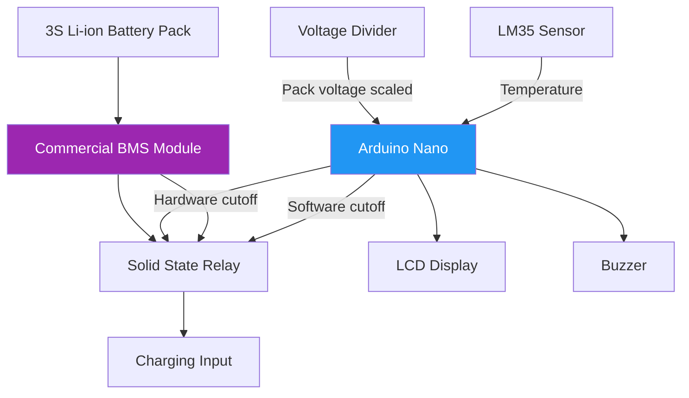
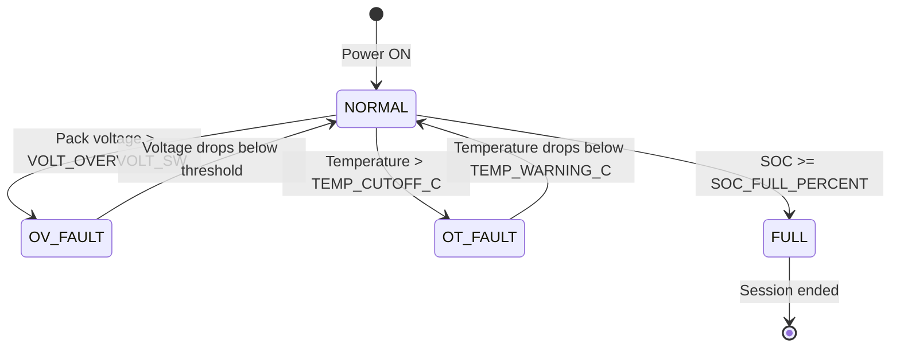

# Battery Management System (BMS) Design

## Overview

This project uses a **dual-layer BMS strategy**: a commercial hardware BMS module provides fast, hardware-level protection independent of the microcontroller, while Arduino Nano firmware provides a software monitoring layer with LCD feedback and session logging.

---

## BMS Architecture



---

## Layer 1 — Hardware BMS Module

### Protection Features

| Protection Type | Trigger Threshold | Response Time | Action |
|---|---|---|---|
| Overcharge protection | 4.20V ± 0.05V per cell | < 100ms | Disconnects charge MOSFET |
| Over-discharge protection | 2.75V ± 0.1V per cell | < 100ms | Disconnects discharge MOSFET |
| Overcurrent (charge) | 10A (module rated) | < 10ms | Disconnects charge path |
| Short circuit protection | Instantaneous current spike | < 1ms | Disconnects immediately |
| Passive cell balancing | When cells diverge > 50mV | Continuous | Bleeds energy from high cells |

### BMS Module IC (Typical: DW01A / FS8205A or equivalent)

The 3S BMS module typically uses:
- **DW01A** — Protection IC (monitors voltage and current)
- **FS8205A** — Dual N-channel MOSFET array for charge/discharge path switching
- **Passive balancing resistors** — Bleed resistors per cell for equalization

### BMS Module Connections in Circuit

```
[Charging Supply +] → [BMS B+] → [Cell 3 Positive]
                                  [Cell 2 Positive (balancing tap)]
                                  [Cell 1 Positive (balancing tap)]
                                  [Cell 1 Negative = Cell 0 = GND]
[BMS B-] → [SSR Load Side Negative] → [Charging Supply -]
[BMS P+] → [SSR Load Side Positive]
[BMS P-] → [Load Negative]
```

---

## Layer 2 — Software BMS (Arduino Nano Firmware)

### State of Charge (SOC) Estimation

SOC is estimated via a voltage-to-SOC lookup table. Coulomb counting is not used in this prototype (no inline current sensor). The voltage-SOC relationship for Li-ion chemistry is used:

```cpp
// 3S Li-ion pack voltage → SOC mapping
float voltageToSOC(float packVoltage) {
    // Linear interpolation between measured points
    if (packVoltage >= 12.60f) return 100.0f;
    if (packVoltage >= 12.45f) return 95.0f;
    if (packVoltage >= 12.30f) return 90.0f;
    if (packVoltage >= 12.00f) return 75.0f;
    if (packVoltage >= 11.70f) return 60.0f;
    if (packVoltage >= 11.40f) return 45.0f;
    if (packVoltage >= 11.10f) return 30.0f;
    if (packVoltage >= 10.80f) return 15.0f;
    if (packVoltage >= 10.50f) return 10.0f;
    if (packVoltage >= 9.00f)  return 5.0f;
    return 0.0f;
}
```

**Limitations of voltage-based SOC:**
- Accuracy affected by load current (voltage sag under load)
- Hysteresis between charge and discharge curves
- Temperature dependence of Li-ion voltage curve
- Acceptable for prototype-level display; production systems use coulomb counting

### Software Safety Thresholds

```cpp
// config.h — all thresholds configurable
#define TEMP_CUTOFF_C        45.0f   // °C — software overtemp cutoff
#define TEMP_WARNING_C       40.0f   // °C — warning threshold
#define VOLT_MAX_3S          12.60f  // V  — full charge (4.20V × 3)
#define VOLT_MIN_3S          9.00f   // V  — deep discharge warning
#define VOLT_OVERVOLT_SW     12.65f  // V  — software overvoltage fault
#define SOC_FULL_PERCENT     98.0f   // %  — stop charging at 98% SOC
```

### Fault State Machine



### Temperature Monitoring

LM35 is read every 2 seconds. Reading is filtered with a simple running average to reject noise:

```cpp
float readTemperatureC() {
    int raw = analogRead(TEMP_PIN);
    float voltage = raw * (5.0f / 1024.0f);
    return voltage * 100.0f;  // LM35: 10mV/°C
}

// Running average (N=4 samples)
float tempBuffer[4] = {25.0f, 25.0f, 25.0f, 25.0f};
int tempIdx = 0;

float filteredTemp() {
    tempBuffer[tempIdx++ % 4] = readTemperatureC();
    float sum = 0;
    for (int i = 0; i < 4; i++) sum += tempBuffer[i];
    return sum / 4.0f;
}
```

### State of Health (SOH) — Conceptual

The current prototype does not implement SOH estimation (requires long-term discharge cycle tracking). In a production version, SOH would be estimated by tracking:
- Capacity fade: `SOH = C_actual / C_rated × 100%`
- Internal resistance increase (requires current sensor)
- Cycle count from EEPROM log

---

## Charging Termination Criteria

Charging stops (SSR goes LOW) when **any** of these conditions is met:

| Condition | Detection Method | Priority |
|---|---|---|
| SOC ≥ 98% | Voltage-SOC lookup | Normal termination |
| Pack voltage ≥ 12.60V | ADC voltage reading | Normal termination |
| BMS hardware trip | BMS disconnects charge MOSFET | Hardware (independent of MCU) |
| Temperature > 45°C | LM35 reading | Emergency cutoff |
| Session time elapsed | millis() timer | Payment-based termination |
| Software overvoltage fault | ADC reading > VOLT_OVERVOLT_SW | Emergency cutoff |

---

## EEPROM Session Logging

Session data is stored in Arduino Nano's 1KB internal EEPROM:

```cpp
struct SessionRecord {
    uint32_t timestamp_s;    // Session start (seconds since boot)
    uint16_t duration_min;   // Session duration in minutes
    uint8_t  start_soc;      // SOC at session start (%)
    uint8_t  end_soc;        // SOC at session end (%)
    uint16_t energy_wh_x10;  // Energy × 10 (stored as integer, e.g. 52 = 5.2 Wh)
    uint8_t  fault_code;     // 0 = normal end, 1 = OV, 2 = OT, 3 = BMS
};
// Size: 11 bytes per record → 1024 / 11 = 93 records max
// EEPROM wear: rated 100,000 write cycles per address
```
