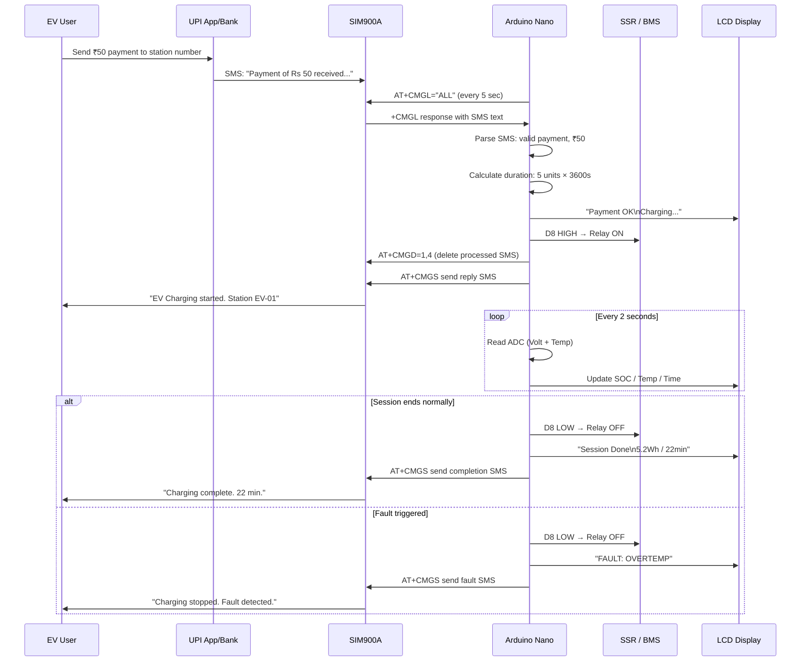

# GSM Integration — SIM900A Payment Verification

## Overview

The GSM SIM900A module is the core of the payment verification system. It receives UPI payment confirmation SMS messages and allows the Arduino Nano to parse and verify them via AT commands over a UART SoftwareSerial connection.

---

## SIM900A Module Specifications

| Parameter | Value |
|---|---|
| Chipset | SIM900A |
| Frequency Bands | 900/1800 MHz (Asia/India compatible) |
| Interface | UART (TTL level, 3.3V/5V compatible) |
| Default Baud Rate | 9600 bps (auto-negotiates) |
| Supply Voltage | 3.4V – 4.4V (nominal 4.0V) |
| Peak Current | Up to 2A (during TX burst) |
| Sleep Current | ~1 mA |
| SMS Standard | 3GPP TS 23.040 |
| SIM Card | Standard SIM (1.8V / 3V) |

---

## AT Command Reference (Used in This Project)

| AT Command | Purpose | Expected Response |
|---|---|---|
| `AT` | Module health check | `OK` |
| `AT+CMGF=1` | Set SMS text mode | `OK` |
| `AT+CSCA?` | Query SMS service center | `+CSCA: "+91xxxxxxxxx",145` |
| `AT+CMGL="ALL"` | List all SMS messages | `+CMGL: index,...` + message text |
| `AT+CMGL="REC UNREAD"` | List unread SMS only | `+CMGL: index,...` + message text |
| `AT+CMGR=<index>` | Read specific SMS by index | `+CMGR: ...` + message text |
| `AT+CMGD=1,4` | Delete all read messages | `OK` |
| `AT+CMGS="<number>"` | Send SMS (enter message, end with Ctrl+Z = 0x1A) | `+CMGS: <ref>` |
| `AT+CPIN?` | Check SIM card status | `+CPIN: READY` |
| `AT+CREG?` | Check network registration | `+CREG: 0,1` (1=registered) |
| `AT+CSQ` | Signal quality (RSSI) | `+CSQ: 18,0` (range: 0–31) |

---

## Initialization Sequence

```cpp
void initGSM() {
    gsmSerial.begin(9600);
    delay(2000);  // Allow SIM900A to boot

    sendAT("AT", "OK", 2000);              // Health check
    sendAT("AT+CMGF=1", "OK", 2000);       // Text mode
    sendAT("AT+CNMI=0,0,0,0,0", "OK", 2000); // Disable auto-forward (poll mode)

    // Verify network registration
    String reg = sendAT("AT+CREG?", "+CREG:", 3000);
    if (reg.indexOf(",1") == -1 && reg.indexOf(",5") == -1) {
        // Not registered — show warning on LCD
        displayMessage("GSM: No Network");
    }
}
```

---

## SMS Polling Logic

The Arduino polls for new messages every 5 seconds to avoid missing payment confirmations:

```cpp
void pollForPaymentSMS() {
    static unsigned long lastPoll = 0;
    if (millis() - lastPoll < SMS_POLL_INTERVAL_MS) return;
    lastPoll = millis();

    gsmSerial.println("AT+CMGL=\"ALL\"");
    delay(500);

    String response = "";
    while (gsmSerial.available()) {
        response += (char)gsmSerial.read();
    }

    if (response.indexOf("+CMGL:") != -1) {
        parsePaymentSMS(response);
    }
}
```

---

## SMS Parsing Algorithm

UPI payment SMS messages follow predictable formats from Indian banks and UPI apps:

**Sample SMS formats:**
- Google Pay: `"Rs.50.00 paid to STATION NAME. UPI Ref: 123456789012. 19 Jun 2026 10:30:05"`
- PhonePe: `"Payment of Rs 50 done to XXXX via PhonePe. Ref No: 12345678"`
- BHIM: `"Dear Customer, Rs.50.00 has been credited to your VPA xxxx@upi on 19-06-2026"`
- Bank SMS: `"INR 50.00 credited to A/C XXXXXX from UPI:username@paytm. Ref:123456"`

**Parsing logic:**

```cpp
struct PaymentInfo {
    bool  isValid;
    float amount;
};

PaymentInfo parseSMS(const String& smsText) {
    PaymentInfo result = {false, 0.0f};

    // Check for payment-positive keywords
    bool hasCredit = smsText.indexOf("credited")   != -1 ||
                     smsText.indexOf("received")   != -1 ||
                     smsText.indexOf("paid")        != -1 ||
                     smsText.indexOf("Payment of") != -1 ||
                     smsText.indexOf("Rs.")         != -1 ||
                     smsText.indexOf("INR")         != -1;

    if (!hasCredit) return result;

    // Reject debit/failure keywords
    if (smsText.indexOf("debited")  != -1 ||
        smsText.indexOf("failed")   != -1 ||
        smsText.indexOf("declined") != -1 ||
        smsText.indexOf("reversed") != -1) {
        return result;
    }

    // Extract amount (search for Rs.XX or INR XX pattern)
    float amount = extractAmount(smsText);
    if (amount < MIN_PAYMENT_RS) return result;  // Below minimum

    result.isValid = true;
    result.amount  = amount;
    return result;
}

float extractAmount(const String& text) {
    // Search for "Rs." or "Rs " followed by digits
    int rsIdx = text.indexOf("Rs.");
    if (rsIdx == -1) rsIdx = text.indexOf("Rs ");
    if (rsIdx == -1) rsIdx = text.indexOf("INR ");

    if (rsIdx == -1) return 0.0f;
    rsIdx += 3;  // Skip "Rs." prefix

    String numStr = "";
    for (int i = rsIdx; i < text.length(); i++) {
        char c = text[i];
        if (isDigit(c) || c == '.') numStr += c;
        else if (numStr.length() > 0) break;  // End of number
    }

    return numStr.toFloat();
}
```

---

## Charging Duration Calculation

Once a valid payment is confirmed:

```cpp
uint32_t calculateChargeDuration(float amountRs) {
    // Duration in seconds = (amount / rate_per_unit) × 3600
    // Default: ₹10 per unit (1 kWh = 1 unit)
    float units = amountRs / RATE_PER_UNIT_RS;
    return (uint32_t)(units * 3600UL);  // Convert to seconds
}
```

Example: ₹50 payment at ₹10/unit = 5 units = 5 hours of charging credit.
In practice, a 3S Li-ion demo pack reaches full charge in 20–40 minutes, so time-based cutoff triggers before the credit expires.

---

## Reply SMS to User

After session start and end, an optional confirmation SMS is sent back:

```cpp
void sendSMS(const char* number, const char* message) {
    gsmSerial.print("AT+CMGS=\"");
    gsmSerial.print(number);
    gsmSerial.println("\"");
    delay(100);
    gsmSerial.print(message);
    gsmSerial.write(0x1A);  // Ctrl+Z — sends SMS
    delay(3000);            // Wait for send confirmation
}

// Usage:
sendSMS("+91XXXXXXXXXX", "EV Charging started. Station: EV-01. Tap us at 98765XXXXX.");
// ... at session end:
sendSMS("+91XXXXXXXXXX", "Charging complete. Energy: 5.2 Wh. Duration: 22 min.");
```

---

## GSM Communication Flow Diagram



---

## Failure Handling

| Failure Mode | Detection | Response |
|---|---|---|
| SIM900A not responding | `AT` returns no `OK` | LCD: "GSM Error"; system stays IDLE; retry after 30s |
| No network registration | `AT+CREG?` returns `0,0` | LCD: "No Network"; retry every 60s |
| SMS buffer overflow | response buffer > 512 bytes | Flush buffer; delete all SMS; continue |
| Payment keywords not found | SMS received but no match | Delete SMS; LCD: "Invalid SMS" |
| Duplicate SMS trigger | Same payment re-processed | Maintain last-processed SMS index; reject duplicates |
| Send SMS failure | `+CMGS` not received in response | Retry once; log failure to EEPROM |

---

## Network Requirements

- **2G GSM coverage** at the installation site (SIM900A does not support 3G/4G)
- **SIM card** with active SMS service (prepaid or postpaid)
- **UPI-registered mobile number** for the station — users send payment to this number
- **Bank must send SMS credits** to the station SIM (standard for all major Indian banks)

> **Important:** Jio 4G SIMs do not support 2G data but do support 2G voice/SMS. SIM900A works with Jio for SMS, but may not register on data. Use Airtel or BSNL SIMs for guaranteed compatibility with the SIM900A.
