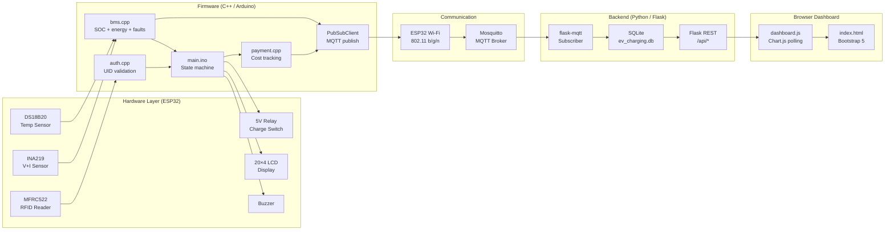

# System Architecture

## Layer Model

The system is divided into four layers:

```
┌─────────────────────────────────────────────────┐
│  Layer 4 — Presentation                         │
│  Web Dashboard (Flask, Chart.js, Bootstrap)     │
├─────────────────────────────────────────────────┤
│  Layer 3 — Application / Backend                │
│  Flask REST API, MQTT Subscriber, SQLite ORM    │
├─────────────────────────────────────────────────┤
│  Layer 2 — Communication                        │
│  Wi-Fi (ESP32), MQTT (Mosquitto), JSON          │
├─────────────────────────────────────────────────┤
│  Layer 1 — Embedded / Hardware                  │
│  ESP32 + Sensors + Relay + LCD + RFID           │
└─────────────────────────────────────────────────┘
```

---

## Component Responsibilities

### ESP32 (Main Controller)
- Runs the state machine (IDLE / CHARGING / FULL / FAULT)
- Drives all peripherals via SPI, I2C, 1-Wire, and GPIO
- Owns all safety-critical decisions (relay control, fault detection)
- Is the only node that can open/close the charging relay

**Design decision:** All safety logic lives on-device. The cloud/dashboard is display-only and cannot command the relay. This prevents a network outage from affecting charging safety.

### BMS Module (`bms.cpp`)
- Reads INA219 every 1 second for voltage and current
- Reads DS18B20 for temperature
- Integrates energy (Wh) using trapezoidal approximation over 1-second intervals
- Estimates SOC via a lookup table
- Checks three fault conditions (OVP, OTP, OCP)

### Auth Module (`auth.cpp`)
- Reads MFRC522 on every loop iteration (non-blocking using `PICC_IsNewCardPresent`)
- Compares scanned UID against up to 4 stored UIDs in EEPROM
- Returns bool; calling code decides the consequence

### Payment Module (`payment.cpp`)
- Tracks session start time and user UID
- On session end, computes cost from accumulated energy and unit rate
- Writes a compact log entry to EEPROM circular buffer

### MQTT Handler (inline in `main.ino`)
- Publishes to three topics: `ev/telemetry`, `ev/session`, `ev/fault`
- Uses PubSubClient with a 60-second keepalive
- Auto-reconnects if broker connection drops

### Flask App (`app.py`)
- Subscribes to all `ev/*` MQTT topics via flask-mqtt
- Writes telemetry and session events to SQLite
- Exposes four REST endpoints: `/api/live`, `/api/history`, `/api/sessions`, `/api/stats`
- Serves the single-page HTML dashboard

---

## Data Flow Diagram



---

## MQTT Topic Schema

| Topic | Direction | Payload (JSON) | Frequency |
|---|---|---|---|
| `ev/telemetry` | ESP32 → Broker | voltage, current, soc, temp, energy, elapsed | Every 5 s |
| `ev/session` | ESP32 → Broker | event, uid, energy_wh, cost_rs, duration_s | On start/end |
| `ev/fault` | ESP32 → Broker | event, uid, reason | On fault |

---

## Sequence: Normal Charging Session

```
User taps card
    │
    ▼
ESP32 reads UID → EEPROM match?
    │ YES
    ▼
Relay CLOSES ──► Battery charges
    │
    ├── Every 1s: read sensors, integrate energy, check faults
    │
    ├── Every 5s: publish ev/telemetry
    │
    ├── LCD updates every 1s: SOC %, voltage, temp, time
    │
User taps card again (or SOC = 100%)
    │
    ▼
Relay OPENS
Calculate cost = (energy_wh / 1000) × rate
Log to EEPROM
Publish ev/session { event: session_end, ... }
Display bill on LCD for 10 s
Return to IDLE
```

---

## Security Considerations (Prototype Level)

| Concern | Current status | Mitigation needed for production |
|---|---|---|
| RFID cloning | UIDs can be cloned with cheap tools | Use MIFARE DESFire with challenge-response auth |
| MQTT no auth | Broker accepts all connections | Enable username/password + TLS on Mosquitto |
| EEPROM UIDs readable | Anyone with UART access can dump UIDs | Encrypt with AES or use secure element |
| HTTP dashboard | No authentication on Flask routes | Add Flask-Login + HTTPS |
| Over-the-air updates | No OTA implemented | Add Arduino OTA or ESP-IDF OTA with signature check |

These are known and acceptable limitations for a diploma-level prototype operating in a supervised lab environment.
