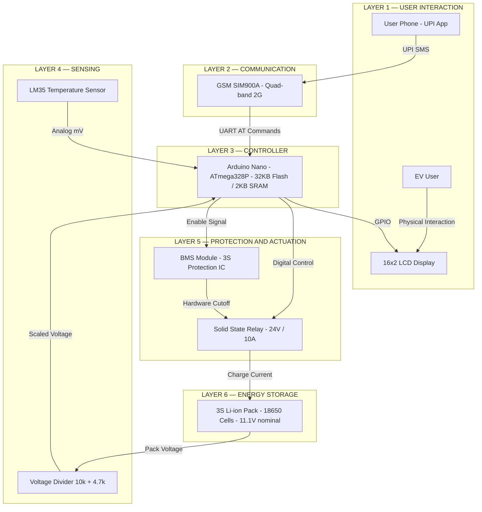
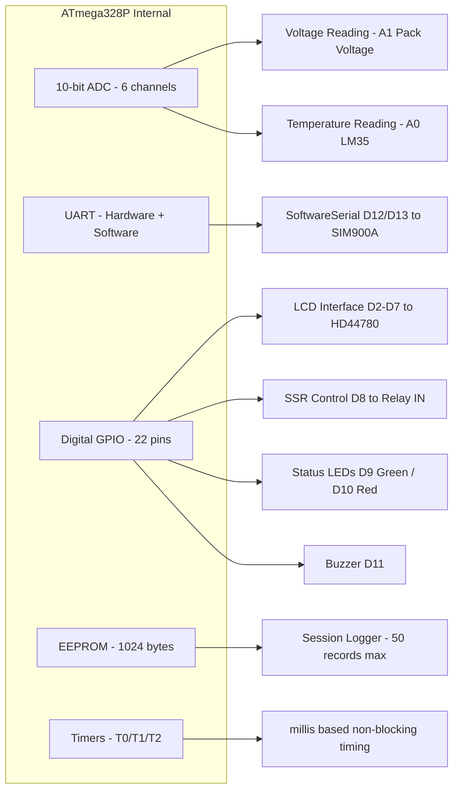
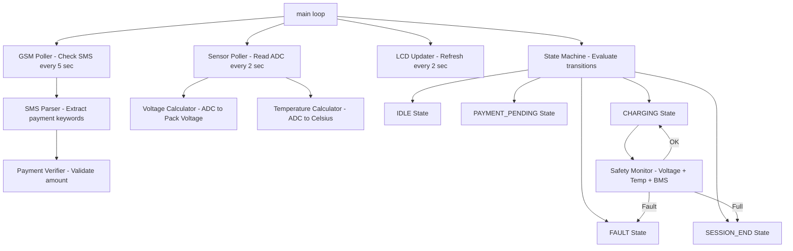

# System Architecture — Smart EV Charging Station with BMS

## Overview

The system is built around an **Arduino Nano (ATmega328P)** as the central controller, orchestrating four subsystems: GSM payment verification, battery monitoring, protection control, and user feedback. The architecture is deliberately lean — all logic fits within 32KB of flash and 2KB of SRAM.

---

## Hardware Architecture Layers

---

## Controller Architecture (Arduino Nano)

---

## Software Architecture

---

## Memory Layout (ATmega328P)

| Region | Size | Used For |
|---|---|---|
| Flash | 32 KB | Program code + string constants |
| SRAM | 2 KB | Runtime variables, LCD buffer, SMS buffer |
| EEPROM | 1 KB | Session records (50 × ~20 bytes) |
| Bootloader | 2 KB | Arduino bootloader (reserved) |

**Memory optimization decisions:**
- SoftwareSerial used instead of hardware serial to free hardware UART for debugging
- LCD strings stored in `PROGMEM` to reduce SRAM usage
- SMS receive buffer limited to 160 characters (single SMS length)
- No dynamic memory allocation — all buffers are statically declared

---

## Communication Protocols

| Interface | Protocol | Peripheral | Speed |
|---|---|---|---|
| Arduino ↔ GSM SIM900A | UART (SoftwareSerial) | SIM900A | 9600 baud |
| Arduino ↔ LCD | Parallel 4-bit | HD44780 | GPIO toggle |
| Arduino ↔ LM35 | Analog | LM35 | ADC sampling |
| Arduino ↔ Voltage Divider | Analog | Resistors | ADC sampling |
| Arduino ↔ SSR | Digital GPIO | SSR | HIGH/LOW |
| Arduino ↔ BMS | Digital GPIO (enable) | BMS IC | HIGH/LOW |

---

## Design Decisions

| Decision | Rationale |
|---|---|
| Arduino Nano over UNO | Smaller form factor for compact prototype |
| SoftwareSerial for GSM | Frees hardware UART for debug Serial monitor |
| LM35 over DS18B20 | No external library needed; direct ADC reading |
| Voltage divider over INA219 | Lower cost; sufficient accuracy for 3S Li-ion display |
| Commercial BMS module | Hardware protection more reliable than software-only |
| SSR over mechanical relay | Silent operation; faster switching; no contact wear |
| 16×2 LCD over OLED | Lower cost; adequate for field data display |
| EEPROM logging | Persistent session data across power cycles |
