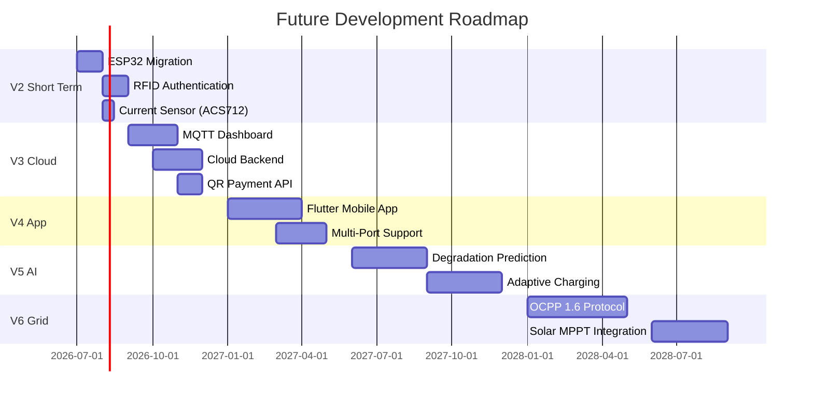

# Future Improvements

> **Important:** All items in this document are **proposed upgrades only**. None are implemented in the current prototype. The current system uses Arduino Nano + GSM SIM900A as described in the main README.

---

## Immediate Upgrades (V2 — Short Term)

### V2.1 — Replace Arduino Nano with ESP32

**Why:** ESP32 provides built-in Wi-Fi (802.11 b/g/n), Bluetooth, dual-core Xtensa LX6 processor, 520KB SRAM, 4MB flash, and hardware UART — eliminating SoftwareSerial constraints.

**Impact:**
- Eliminate SoftwareSerial instability with GSM
- Add Wi-Fi for OTA firmware updates
- Enable MQTT telemetry without hardware changes
- Open path to web dashboard integration

**Estimated effort:** 2–3 days; firmware rewrite required due to ESP32 API differences.

### V2.2 — RFID User Authentication

**Why:** SMS-only payment verification has no per-user session tracking. RFID (MFRC522) enables registered-user model.

**Implementation:**
- MFRC522 on SPI interface
- EEPROM/SPIFFS whitelist of authorized UIDs
- Session tied to user UID for analytics

### V2.3 — Dedicated Current Sensor (ACS712)

**Why:** Current SOC estimation relies solely on voltage, which has known inaccuracies. Adding ACS712-5A enables coulomb counting for accurate SOC.

**Formula:** `SOC(t) = SOC(t₀) + (∫ I(t) dt) / C_rated × 100%`

### V2.4 — Upgraded Temperature Sensing (DS18B20)

**Why:** DS18B20 provides ±0.5°C digital accuracy over 1-Wire; immune to ADC noise that affects LM35. Also supports multiple sensors on single wire (for per-cell temperature).

---

## Mid-Term Enhancements (V3 — Cloud Connected)

### V3.1 — MQTT IoT Dashboard

**Technology:** ESP32 + Mosquitto MQTT Broker + Flask/Node-RED

**Architecture:**
```
ESP32 → Wi-Fi → MQTT Broker → Flask App → Browser Dashboard
```

**Dashboard features:**
- Live SOC gauge
- Temperature trend chart
- Session history table
- Payment ledger

### V3.2 — Cloud Backend

**Technology:** AWS IoT Core or Firebase Realtime Database

**Benefits:**
- Multi-station management from single dashboard
- Remote monitoring and alerts
- Long-term session analytics
- OTA firmware updates via AWS IoT

### V3.3 — QR Code Payment Integration

**Technology:** Razorpay / PayU API

**Why:** Replaces SMS parsing with verified API callbacks — eliminates false-positive SMS parsing issues and supports multiple payment methods (UPI, card, wallet).

---

## Advanced Features (V4 — Mobile App)

### V4.1 — Flutter Mobile Application

**Technology:** Flutter (Android + iOS)

**Features:**
- User registration and RFID card management
- QR scan to start session
- Live session monitoring via MQTT WebSocket
- Payment history
- Station locator map

### V4.2 — Multi-Port Station

**Technology:** ESP32 + 4× SSRs + 4× BMS modules

**Benefit:** Single controller manages 4 simultaneous charging ports with independent BMS and payment tracking per port.

---

## AI & Analytics (V5)

### V5.1 — Battery Degradation Prediction

**Technology:** LSTM neural network on historical SOC/capacity data

**Input features:**
- Cycle count
- Temperature history
- Charge/discharge rate
- Capacity fade measurements

**Output:** Predicted remaining cycle life (SOH trend)

### V5.2 — Adaptive Charging Algorithm

**Technology:** Reinforcement learning on charging parameters

**Goal:** Maximize battery life by dynamically adjusting charging rate based on temperature, SOC, and historical degradation rate.

---

## Grid Integration (V6)

### V6.1 — OCPP 1.6 Protocol

**Technology:** Open Charge Point Protocol implementation on ESP32

**Benefit:** Interoperability with commercial Charge Point Management Systems (CPMS) — enables the station to connect to networks like Ather Grid, Tata Power EV, or state-run EVSE networks.

### V6.2 — Demand Response Charging

**Technology:** Grid signal API + smart scheduling

**Concept:** Station defers charging to off-peak hours when grid signals indicate high load, reducing electricity cost and grid stress.

### V6.3 — Solar MPPT Integration

**Technology:** MPPT controller (e.g., CN3722) + solar panel input

**Architecture:**
```
Solar Panel → MPPT Controller → Battery Pack (via BMS)
Grid Supply → SSR (backup) → Battery Pack (via BMS)
```

**Benefit:** Renewable energy reduces per-unit charging cost and carbon footprint.

---

## Hardware Modernization Timeline



See [version_2_roadmap.md](version_2_roadmap.md) for detailed engineering specifications per version.
