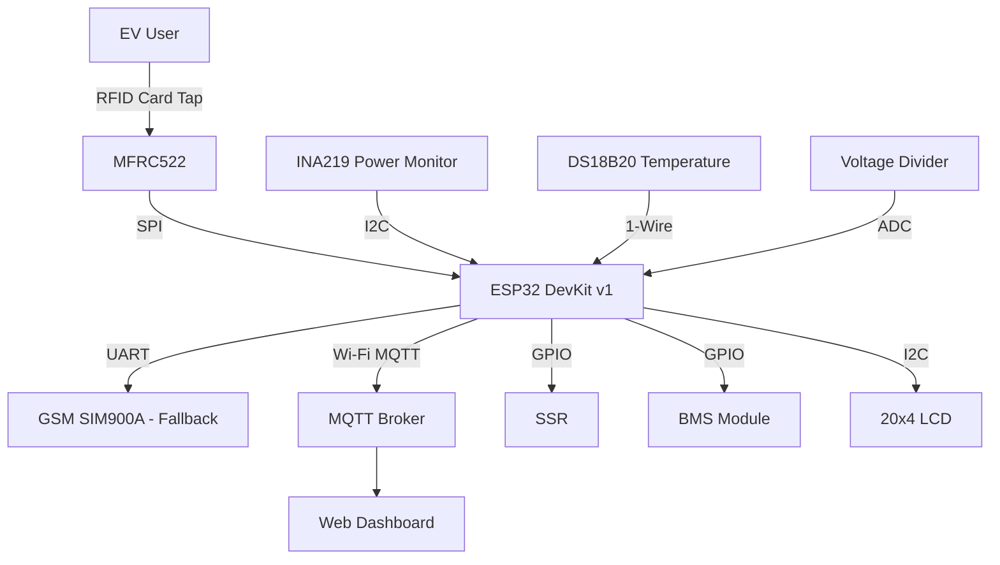
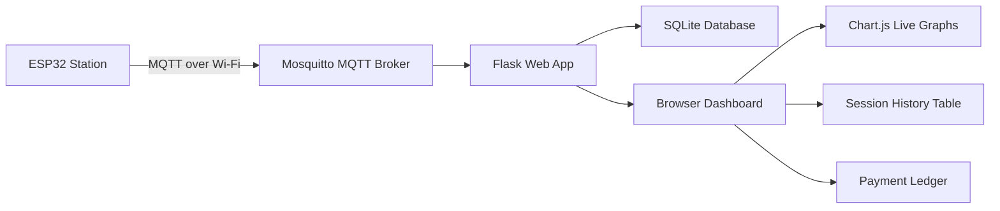
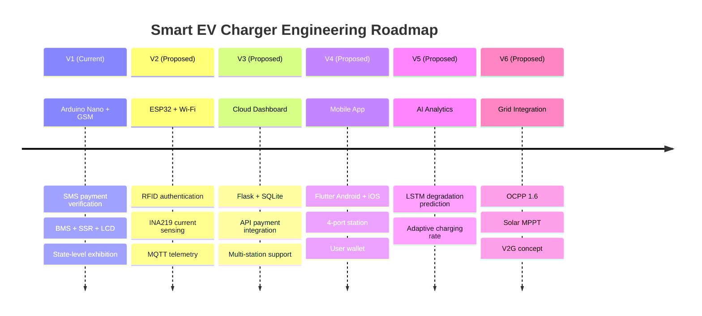

# Version 2 Engineering Roadmap

> All versions below are **proposed future developments**. The current implemented version (V1) uses Arduino Nano + GSM SIM900A as described in the main README.

---

## V1 — Current Implementation (Arduino Nano + GSM)

**Status:** Built and demonstrated at State-Level Exhibition

| Component | Hardware | Status |
|---|---|---|
| Controller | Arduino Nano (ATmega328P) | Implemented |
| Communication | GSM SIM900A | Implemented |
| Payment | UPI SMS parsing | Implemented |
| Temperature | LM35 | Implemented |
| Voltage | Resistor divider + ADC | Implemented |
| Charging control | Solid State Relay | Implemented |
| Battery protection | Commercial BMS module | Implemented |
| Display | 16×2 LCD | Implemented |
| Storage | EEPROM (1KB) | Implemented |

**Limitations identified:**
- 2G only (SIM900A does not support 3G/4G)
- No remote monitoring
- Voltage-only SOC estimation (no current sensing)
- Single charging port
- Manual payment verification (no API)
- No user authentication

---

## V2 — ESP32 + Wi-Fi (Proposed)

**Target timeline:** 2–3 months post V1

### V2 Changes

| Upgrade | From | To |
|---|---|---|
| Controller | Arduino Nano | ESP32 DevKit v1 |
| Connectivity | GSM 2G only | Wi-Fi 802.11 b/g/n + GSM fallback |
| Authentication | None | RFID (MFRC522) |
| Current sensing | None | ACS712-5A or INA219 |
| Temperature | LM35 (analog) | DS18B20 (digital, 1-Wire) |
| Serial interface | SoftwareSerial | Hardware UART (no instability) |
| Flash | 32KB | 4MB |
| SRAM | 2KB | 520KB |
| EEPROM | 1KB | SPIFFS on flash |

### V2 Architecture



### V2 New Features
- RFID user authentication (registered cards)
- Accurate SOC via coulomb counting (INA219 measures current)
- Wi-Fi MQTT telemetry (5-second intervals)
- OTA firmware update over Wi-Fi
- Persistent session history in SPIFFS

---

## V3 — Cloud-Connected Dashboard (Proposed)

**Target timeline:** 3–5 months post V2

### V3 Architecture



### V3 Dashboard Features
- Live SOC gauge with Chart.js
- Temperature trend (last 60 minutes)
- Session history with timestamps and energy consumed
- Payment ledger with amount breakdown
- Multi-station support (unique MQTT client ID per station)
- Alert notifications for faults

### V3 Payment Upgrade
- Razorpay / PayU API integration (replace SMS parsing)
- QR code generation per session
- Webhook callback confirms payment before SSR activates
- Digital receipt via email/SMS

---

## V4 — Mobile Application (Proposed)

**Target timeline:** 6–9 months post V3

### V4 Stack

| Layer | Technology |
|---|---|
| Mobile App | Flutter (Dart) — Android + iOS |
| Backend API | FastAPI (Python) |
| Database | PostgreSQL |
| Real-time | WebSocket over MQTT |
| Auth | Firebase Auth (Google/phone login) |
| Payment | Razorpay Flutter SDK |

### V4 App Screens

1. **Home** — Nearby station map, available ports
2. **Scan** — QR scan to begin session
3. **Live Session** — SOC gauge, time elapsed, cost meter
4. **History** — Past sessions with energy and cost
5. **Wallet** — Add money, transaction history
6. **Station Admin** — (Admin role) live port status, revenue dashboard

### V4 Multi-Port Support
- 4-port station with single ESP32 controller
- Independent SSR per port (4× SSR)
- Independent BMS per port
- Session multiplexing via MQTT topics per port

---

## V5 — AI Battery Analytics (Proposed)

**Target timeline:** 12 months post V4

### V5.1 — Battery Degradation Prediction

**Model:** LSTM (Long Short-Term Memory) on TensorFlow Lite

**Input features (per charging session):**
- Session duration
- Average charge current
- Peak temperature
- SOC at start / end
- Capacity (Wh) delivered vs expected
- Cycle count

**Output:** Predicted SOH (State of Health) trend — estimated remaining useful cycles

**Deployment:** TensorFlow Lite model flashed onto ESP32 (or run on cloud API)

### V5.2 — Adaptive Charging Rate

**Concept:** Adjust charge current based on battery temperature and SOC to minimize degradation:

```
If temp > 35°C → reduce charge rate to 0.2C
If SOC > 80%   → switch to trickle charge (constant voltage, reducing current)
Else           → standard 0.5C charge rate
```

**Requires:** Adjustable current source (not simple relay switching) — significant hardware upgrade.

---

## V6 — Smart Grid Integration (Proposed)

**Target timeline:** 18–24 months post V5

### V6.1 — OCPP 1.6 Protocol

**Technology:** Open Charge Point Protocol 1.6 JSON/SOAP

**Enables:**
- Interoperability with any CSMS (Charge Point Management System)
- Remote start/stop sessions from operator dashboard
- Smart charging profiles (load limiting by grid operator)
- Heartbeat and status notification

**Effort:** ~3 months; OCPP library implementation on ESP32

### V6.2 — Vehicle-to-Grid (V2G)

**Concept:** EV battery can feed energy back to grid during peak demand periods.

**Requires:**
- Bidirectional inverter (AC ↔ DC)
- Grid synchronization circuit
- OCPP 2.0.1 + ISO 15118 compliance
- Full grid certification (beyond prototype scope)

### V6.3 — Solar MPPT Integration

**Architecture:**

```
Solar Panel (12V / 20W) → MPPT Controller (CN3722) → Battery Pack
                                                    ↓ (when battery full)
                                    → Excess to Grid (future)

Grid / Adapter (backup) → SSR → Battery Pack (when solar insufficient)
```

**MPPT benefits:**
- Extracts maximum power from solar panel regardless of partial shading
- Reduces electricity cost per kWh
- Enables off-grid operation in daylight

---

## Development Progression Summary


